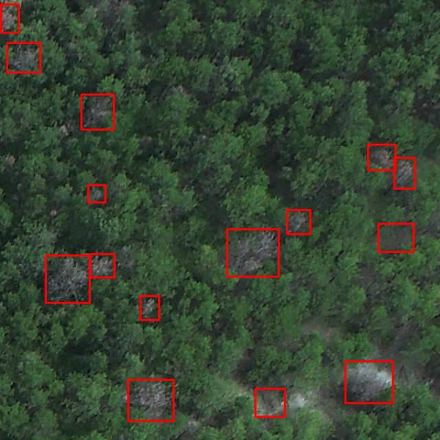

# QUANTIZATION AND DPU DEPLOYMENT FOR CUSTOM - LAYER YOLO MODEL (YOLOvDP - ENHANCED) ON XILINX ZCU102

This repository guides you through quantizing, compiling, and deploying a custom-layer YOLOv5 model (`YOLOvDP-Enhanced`) from PyTorch FP32 (`best.pt`) to an INT8 `.xmodel` running on the **Xilinx ZCU102 DPU**.

---

## **💡 THE  STORY:**
I trained a custom object detection model based on the YOLOv5 architecture, integrated with custom layer structures (**YOLOvDP-Enhanced**), and obtained the floating-point weight file (`best.pt`).

**The main challenge:**
How can I successfully deploy and run this custom model to perform real-time image detection on the Xilinx ZCU102 DPU board?

> 📌 **Note:** The pre-trained weights (`best.pt`) and model source code are available at:  
> 👉 [Enhanced-YOLOvDP-Fps-Upgrade](https://github.com/khangvohoang3007/Enhanced-YOLOvDP-Fps-Upgrade)

Because the Xilinx DPU hardware only supports a fixed set of standard neural network operators, deploying a model with custom layers requires resolving operator incompatibility, performing INT8 quantization via Vitis AI, and compiling the model into an executable `.xmodel`.

---

## 1. 🛠️ Prerequisites & System Setup

### 1.1 Model & Custom Layer Requirements

Different Xilinx edge devices and DPU architectures support different sets of activation functions. For instance, platforms like the KV260 or ZCU102 may not natively support non-linear activations like **SiLU** on the DPU hardware, causing fallback to CPU or quantization errors. In our **YOLOvDP-Enhanced** model, all unsupported activations were explicitly replaced with **LeakyReLU** to ensure seamless INT8 quantization and full DPU hardware acceleration.

> 📌 **Useful Resources:**
> - **Supported Operators Reference:** Check the official [Vitis AI Supported Operators Documentation](https://docs.amd.com/r/en-US/ug1414-vitis-ai/Currently-Supported-Operators) to verify operator compatibility for your target DPU architecture.
> - **Retrained Kaggle Notebook:** View our retrained model and weight preparation process on [Kaggle](https://www.kaggle.com/code/gautapcode/vitis-ai).

#### Required Code Modifications
When modifying a Ultralytics YOLOv5 repository to adapt custom layers and activation functions, you need to adjust several core files depending on your specific network design:

- `models/common.py` (Defines custom block structures and activation layer mappings)
- `models/yolo.py` (Handles parsing and building network architecture layers)
- `models/experimental.py` (Contains experimental modules and layer wrappers)
- `train.py` (Configures training parameters and model initialization)

> 💡 **Reference Guide:** For a detailed breakdown of replacing activation layers and modifying YOLOv5 source code for Vitis AI compatibility, refer to this [Hackster.io Guide on YOLOv5 Quantization with Vitis AI 3.0](https://www.hackster.io/LogicTronix/yolov5-quantization-compilation-with-vitis-ai-3-0-for-kria-7b005d).

### 1.2 Host Environment Setup (Ubuntu, Docker, Vitis AI)

To perform INT8 quantization, model inspection, and compilation, you must prepare the host environment with the official Vitis AI Docker container. You can follow the [Official Vitis AI MPSoC Setup Guide](https://xilinx.github.io/Vitis-AI/3.0/html/docs/quickstart/mpsoc.html) or run the commands below.

#### Step 1: Install Ubuntu via WSL2 (Windows PowerShell)

If operating on a Windows machine, set up an Ubuntu 20.04 environment using Windows Subsystem for Linux (WSL2):

```powershell
# Installs Ubuntu 20.04 distribution via WSL
wsl --install -d Ubuntu-20.04

# Lists all available online Linux distributions
wsl --list --online

# Launches the Ubuntu 20.04 environment
wsl -d Ubuntu-20.04
```

#### Step 2: Verify Docker on Ubuntu WSL
After launching Ubuntu WSL and installing Docker Desktop (with WSL 2 backend integration enabled), run the following commands to clone Vitis AI and verify your container runtime:

```host
# Clones the official Xilinx Vitis AI repository
git clone [https://github.com/Xilinx/Vitis-AI](https://github.com/Xilinx/Vitis-AI)

# Verifies Docker runtime permissions and connectivity
docker run hello-world

# Checks the installed Docker client and engine versions
docker --version
```

#### Step 3: Pull Vitis AI Docker Image
Pull the CPU-based PyTorch Docker image maintained by Xilinx:
```host
docker pull xilinx/vitis-ai-pytorch-cpu:latest
```

#### Step 4: Launch Container & Configure Environment
Navigate to the root directory of the cloned Vitis-AI repo, start the Docker container, and activate the required Python dependencies:

```host
# Launches the Vitis AI Docker container with workspace auto-mounted
./docker_run.sh xilinx/vitis-ai-pytorch-cpu:latest

# Activates the target PyTorch conda environment configured for Vitis AI quantization
conda activate vitis-ai-pytorch

# Installs supplementary packages required by the customized YOLOv5 architecture
pip install seaborn timm efficientnet_pytorch
```

> [!NOTE]
> **Troubleshooting & Optimization Tips:**
> 
> * **WSL2 Memory Usage:** If you encounter performance issues with Ubuntu or WSL consuming excessive host RAM, you can limit the WSL virtual machine memory allocation (e.g., capping it at 4GB or 8GB depending on your quantization workload; setting `memory=1GB` for basic terminal operations). Check this setup guide: [WSL Memory Configuration Guide](https://youtu.be/urDkRPVvd88?si=wpjNyLsrLhyoyzaP).
> * **Docker Disk Space Management:** The Vitis AI Docker container images are quite large and can quickly consume disk capacity. If Docker is taking up too much storage on your system drive, refer to this walkthrough: [Managing & Moving Docker Disk Usage](https://www.youtube.com/watch?v=MFtdjhwC1co).


## 2. 🧮 Model Quantization Workflow (`best.pt` to `.xmodel`)

After starting the Vitis AI Docker container, activating the environment, installing required dependencies, and cloning this repository into your working directory, execute the quantization and compilation workflow as detailed below.

---

### Step 1: Pre-Quantization Setup

**👉 Navigate to the Vitis-AI workspace:**
   ```docker
   cd Vitis-AI
  ```

**👉 Create the model workspace directory:**
  ```docker
  mkdir -p Vitis_Model_Path
  ```

**👉 Copy project repository files:**
Move all necessary files from this repository (including Quant.py, the Calib/ dataset directory, scripts, etc.) into your Vitis-AI workspace directory.

**👉 Prepare Ultralytics YOLOv5 source:**
You can set up the YOLOv5 source code in one of two ways:

- **Option A (Standard):** Clone/install YOLOv5 directly from Ultralytics.
- **Option B (Custom):** Copy your custom YOLOv5 source folder directly into `Vitis_Model_Path/`.

> [!IMPORTANT]
> Ensure core scripts (`common.py`, `yolo.py`, `experimental.py`, etc.) contain your modified activation functions (such as the SiLU-to-ReLU conversions described in Section 1).

> [!TIP]
> Check the template files inside the `Vitis_Model_Path/` directory in this repository for directory structure guidance.

### Step 2: Quantization & DPU Compilation

**👉 Execute Calibration (Pass 1):**
Run `Quant.py` in calibration mode to compute INT8 scaling factors:

  ```docker
   python Quant.py --weights /mnt/best.pt --dataset /mnt/calib/ --build_dir /mnt/build --quant_mode calib
  ```

> [!NOTE]
> Update the `--weights` path to point to your actual `.pt` checkpoint file, and the `--dataset` path to your calibration directory (which must contain the `images/` and `labels/` subfolders).

**👉 Run Evaluation & Export Quantized Artifacts (Pass 2):**
Once calibration completes, execute the script in `test` mode:

   ```docker
   python Quant.py --weights /mnt/best.pt --dataset /mnt/calib/ --build_dir /mnt/build --quant_mode test
   ```
> [!TIP]
> OUTCOME: This generates intermediate artifacts inside the `quant_model/` folder, including `DetectMultiBackend_int.xmodel` and `arch.json`.

**👉 Compile Model for ZCU102 FPGA Board:**
Compile the intermediate `.xmodel` using the Vitis AI compiler (`vai_c_xir`) targeting the ZCU102 DPU architecture (`DPUCZDX8G`):

```docker
   vai_c_xir --xmodel /mnt/build/quant_model/DetectMultiBackend_int.xmodel --arch /opt/vitis_ai/compiler/arch/DPUCZDX8G/ZCU102/arch.json --net_name ourVitis_zcu102 --output_dir /mnt/build/final_model
```

> [!TIP]
> OUTCOME: The compiled FPGA executable `ourVitis_zcu102.xmodel` is saved in `/mnt/build/final_model/`.

> [!NOTE]
> For reference and troubleshooting, sample pre-compiled files from this stage are archived in the `post_quantum/` folder of this repository.

### Step 3: Edge Board Deployment Prerequisites (ZCU102)
To prepare for inference on the ZCU102 target board, gather the following artifacts alongside your generated `.xmodel` file:

**👉 Calibration/Test Dataset Folder:**
A folder containing sample test images scaled to your input resolution (e.g., 640x640).

**👉 Validation File List (`val_list_final.txt`):**
A plain text file listing image relative paths inside your calibration folder (optional if running single/few image inference).

> [!WARNING]
> Ensure filenames declared in `val_list_final.txt` avoid special characters like `(`, `)`, `/`, or `whitespace` to prevent execution errors on VART runtime.

**👉 Model Configuration File (`.prototxt`):**
If deploying standard YOLOv5 architectures (`yolov5s`, `yolov5n`), you can use the pre-configured `.prototxt` files in the `prototxt/` directory. For models with custom layers, construct a custom `.prototxt` file as shown below.

### CUSTOM `.prototxt` CONSTRUCTION GUIDE:
Refer to the standard structure below (example from `yolov5n`):
```
model {
  kernel {
    ...
  }
  model_type : YOLOv3
  yolo_v3_param {
    num_classes: 1                # Set to your trained dataset class count
    anchorCnt: 3
    layer_name: "layer 1"         # Must match output layer node names
    layer_name: "layer 2"
    layer_name: "layer 3"
    ...
    conf_threshold: 0.5           # Set your desired confidence threshold
    nms_threshold: 0.65           # Set your desired NMS threshold

    biases: 10
    ...
    biases: 326
    test_mAP: false
    type: YOLOV5
  }
  is_tf: false                    # Set strictly to false for PyTorch models
}
```

> [!TIP]
> **Determining `layer_name` entries for output layers:**
> 
> 1. Export your trained PyTorch model (`best.pt`) to `.onnx` format.
> 2. Open [netron.app](https://netron.app) and upload your `.onnx` file.
> 3. Scroll down to the final output nodes in the network graph.
> 4. Identify the exact names of all output heads and declare each corresponding string under `layer_name` in sequential order inside your `.prototxt` file.
> 
> *Note: Exact string matching is mandatory for VART to parse model outputs correctly.*

## 3. 🚀 ZCU102 Board Setup & Model Execution

---

### Step 3.1: ZCU102 Target Board Setup

1. **Prepare MicroSD Card:** Prepare a MicroSD card (minimum **32 GB** capacity).
2. **Board Environment & Flashing:**
   - Download the compatible Vitis AI board image/packages for ZCU102.
   - For step-by-step setup and board installation instructions, please follow the [Official Vitis AI Setup Guide](https://github.com/Xilinx/Vitis-AI) to keep this guide concise.
   - Alternatively, a detailed step-by-step setup guide in **Vietnamese** (covering board configuration, OS flashing, and PC-to-Board serial/SSH connection) is provided inside the `documents/` folder of this repository.

---

### Step 3.2: Running Inference on ZCU102 Board

#### 1. Transfer Deployment Artifacts
Transfer the required files to your target workspace on the ZCU102 board:

- **Model Deployment Folder (`ourVitis_zcu102/`):** Contains `md5sum.txt`, `meta.json`, `ourVitis_zcu102.xmodel`, and `ourVitis_zcu102.prototxt`.
- **Validation Data Folder (`calib/`):** Contains test images and the image declaration list (`val_list_final.txt`).

---

#### 2. Execute Detection Commands

* **Single Image Detection:**
  Run the test executable on a single test image:
  ```bash
  ./test_jpeg_yolov5 ourVitis_zcu102.xmodel test640.jpeg
  ```
* **Batch / Multithreaded Accuracy Evaluation:**
   Run batch inference across the entire evaluation dataset:
  ```bash
  ./test_accuracy_yolov5_mt ourVitis_zcu102 val_list_final.txt out_results.txt -t 1
  ```
> [!NOTE]
> The directory `ourVitis_zcu102/` must contain both the `.xmodel` and `.prototxt` files. The execution will output bounding box predictions saved inside `out_results.txt`.

#### 3. Post-Processing & Accuracy Comparison
After generating `out_results.txt`, transfer the file back to your host machine to:
- Draw bounding boxes and render detected output images.
- Run custom evaluation Python scripts to compare detection results against ground-truth labels.

### 🖼️ Detection Output Sample


